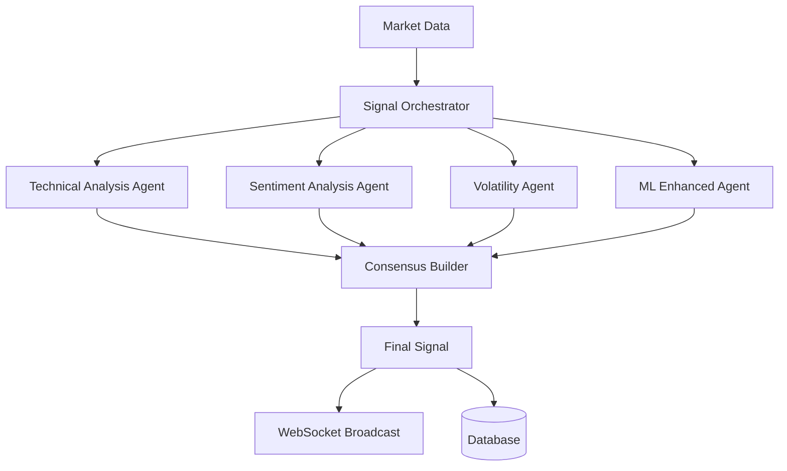

# AI Agents Documentation

GoldenSignalsAI employs a multi-agent system for comprehensive market analysis and trading signal generation.

## Agent Architecture



## Base Agent Framework

All agents inherit from the `BaseAgent` class:

```python
from agents.base import BaseAgent, SignalAction, SignalStrength

class CustomAgent(BaseAgent):
    def __init__(self, agent_id: str):
        super().__init__(agent_id)
        self.name = "Custom Agent"
        
    async def analyze(self, symbol: str, timeframe: str) -> Dict[str, Any]:
        # Implementation
        return {
            "symbol": symbol,
            "signal": SignalAction.BUY,
            "confidence": 0.85,
            "reasoning": ["Analysis reasoning"]
        }
```

### Agent Configuration

```python
# Agent configuration
config = AgentConfig(
    name="technical_analysis_agent",
    enabled=True,
    weight=0.4,  # Importance in consensus
    timeout=30,  # Analysis timeout in seconds
    parameters={
        "rsi_period": 14,
        "macd_fast": 12,
        "macd_slow": 26,
        "bollinger_period": 20
    }
)
```

## Available Agents

### 1. Technical Analysis Agent

**Purpose**: Analyzes price and volume patterns using technical indicators.

**Key Features**:
- RSI, MACD, Bollinger Bands
- Moving averages (SMA, EMA)
- Support/resistance levels
- Chart pattern recognition

**Implementation**:
```python
from agents.technical_analysis_agent import TechnicalAnalysisAgent

agent = TechnicalAnalysisAgent("tech_agent_1")
result = await agent.analyze("AAPL", "1d")

# Output example:
{
    "symbol": "AAPL",
    "signal": "BUY",
    "confidence": 0.82,
    "reasoning": [
        "RSI oversold recovery (28 → 45)",
        "MACD bullish crossover",
        "Price breakout above resistance"
    ],
    "indicators": {
        "rsi": 45.2,
        "macd_line": 0.45,
        "macd_signal": 0.12,
        "bb_position": 0.7
    },
    "price_target": 160.0,
    "stop_loss": 145.0
}
```

**Configuration Parameters**:
- `rsi_period`: RSI calculation period (default: 14)
- `ma_short`: Short moving average (default: 9)
- `ma_long`: Long moving average (default: 21)
- `bb_period`: Bollinger Bands period (default: 20)
- `volume_threshold`: Volume significance threshold (default: 1.5)

### 2. Sentiment Analysis Agent

**Purpose**: Analyzes market sentiment from news, social media, and analyst reports.

**Data Sources**:
- News headlines and content
- Twitter/X sentiment
- Reddit discussions
- Analyst recommendations

**Implementation**:
```python
from agents.sentiment_analysis_agent import SentimentAnalysisAgent

agent = SentimentAnalysisAgent("sentiment_agent_1")
result = await agent.analyze("AAPL", "1d")

# Output example:
{
    "symbol": "AAPL",
    "signal": "BUY",
    "confidence": 0.73,
    "reasoning": [
        "Positive news sentiment (0.8/1.0)",
        "Social media bullish (70% positive)",
        "Analyst upgrades outnumber downgrades 3:1"
    ],
    "sentiment_breakdown": {
        "news": 0.8,
        "social": 0.7,
        "analysts": 0.75,
        "overall": 0.73
    },
    "sources_analyzed": 142,
    "trending_keywords": ["earnings", "growth", "innovation"]
}
```

### 3. Volatility Agent

**Purpose**: Assesses market volatility and risk factors.

**Key Metrics**:
- Implied volatility from options
- Historical volatility
- VIX correlation
- Options flow analysis

**Implementation**:
```python
from agents.volatility_agent import VolatilityAgent

agent = VolatilityAgent("vol_agent_1")
result = await agent.analyze("AAPL", "1d")

# Output example:
{
    "symbol": "AAPL",
    "signal": "HOLD",
    "confidence": 0.68,
    "reasoning": [
        "Implied volatility elevated (30% vs 20% avg)",
        "Options put/call ratio increasing (0.8)",
        "VIX correlation suggests caution"
    ],
    "volatility_metrics": {
        "implied_vol": 0.30,
        "historical_vol": 0.22,
        "vol_rank": 0.75,
        "put_call_ratio": 0.8
    },
    "risk_assessment": "ELEVATED"
}
```

### 4. ML Enhanced Agent

**Purpose**: Uses machine learning models for pattern recognition and prediction.

**Models Used**:
- LSTM for price prediction
- Transformer for sequence modeling
- Ensemble methods for robustness

**Implementation**:
```python
from agents.ml_enhanced_agent import MLEnhancedAgent

agent = MLEnhancedAgent("ml_agent_1")
result = await agent.analyze("AAPL", "1d")

# Output example:
{
    "symbol": "AAPL",
    "signal": "BUY",
    "confidence": 0.89,
    "reasoning": [
        "LSTM predicts 3.2% price increase",
        "Pattern similarity: 0.87 with historical bullish moves",
        "Ensemble model consensus: BUY (4/5 models)"
    ],
    "model_outputs": {
        "lstm_prediction": 155.2,
        "transformer_confidence": 0.91,
        "ensemble_score": 0.89
    },
    "feature_importance": {
        "price_momentum": 0.32,
        "volume_pattern": 0.28,
        "volatility": 0.24,
        "sentiment": 0.16
    }
}
```

## Agent Orchestration

### Signal Orchestrator

The `SignalOrchestrator` coordinates multiple agents:

```python
from core.orchestrator import SignalOrchestrator

orchestrator = SignalOrchestrator()

# Generate consensus signal
result = await orchestrator.generate_signal(
    symbol="AAPL",
    timeframe="1d",
    agents=["technical", "sentiment", "volatility", "ml"]
)

# Output:
{
    "symbol": "AAPL",
    "consensus_signal": "BUY",
    "consensus_confidence": 0.78,
    "agent_signals": {
        "technical": {"signal": "BUY", "confidence": 0.82, "weight": 0.3},
        "sentiment": {"signal": "BUY", "confidence": 0.73, "weight": 0.25},
        "volatility": {"signal": "HOLD", "confidence": 0.68, "weight": 0.2},
        "ml": {"signal": "BUY", "confidence": 0.89, "weight": 0.25}
    },
    "risk_score": 0.35,
    "position_sizing": 0.15,
    "timestamp": "2024-01-01T16:00:00Z"
}
```

### Consensus Algorithm

The consensus algorithm considers:

1. **Signal Weights**: Each agent has a configurable weight
2. **Confidence Levels**: Higher confidence signals have more influence
3. **Disagreement Penalty**: Conflicting signals reduce overall confidence
4. **Risk Adjustment**: High volatility reduces position sizing

```python
def calculate_consensus(agent_signals):
    weighted_scores = []
    total_weight = 0
    
    for agent, result in agent_signals.items():
        weight = result['weight']
        confidence = result['confidence']
        signal_value = signal_to_numeric(result['signal'])
        
        weighted_scores.append(signal_value * confidence * weight)
        total_weight += weight
    
    consensus_score = sum(weighted_scores) / total_weight
    return numeric_to_signal(consensus_score)
```

## Agent Performance Monitoring

### Metrics Collection

```python
# Agent performance metrics
metrics = await agent.get_metrics()

{
    "total_analyses": 1000,
    "successful_analyses": 950,
    "average_confidence": 0.72,
    "average_response_time": 0.85,  # seconds
    "accuracy_metrics": {
        "signals_generated": 800,
        "profitable_signals": 520,
        "accuracy_rate": 0.65,
        "sharpe_ratio": 1.2
    },
    "error_rate": 0.05,
    "last_7_days": {
        "analyses": 70,
        "accuracy": 0.68
    }
}
```

### Performance Tracking

```python
# Track agent performance over time
performance = await orchestrator.get_agent_performance(
    agent_id="technical_agent",
    period="30d"
)

# Backtest agent performance
backtest_results = await agent.backtest(
    symbol="AAPL",
    start_date="2023-01-01",
    end_date="2023-12-31"
)
```

## Custom Agent Development

### Creating a New Agent

```python
from agents.base import BaseAgent
from typing import Dict, Any

class CustomIndicatorAgent(BaseAgent):
    def __init__(self, agent_id: str):
        super().__init__(agent_id)
        self.name = "Custom Indicator Agent"
        
    async def analyze(self, symbol: str, timeframe: str) -> Dict[str, Any]:
        # Get market data
        data = await self.get_market_data(symbol, timeframe)
        
        # Custom analysis logic
        signal = self._calculate_custom_signal(data)
        confidence = self._calculate_confidence(data, signal)
        
        return {
            "symbol": symbol,
            "signal": signal,
            "confidence": confidence,
            "reasoning": self._get_reasoning(data, signal),
            "custom_metrics": {
                "indicator_value": 0.75,
                "trend_strength": 0.8
            }
        }
    
    def _calculate_custom_signal(self, data):
        # Custom signal logic
        pass
        
    def _calculate_confidence(self, data, signal):
        # Confidence calculation
        pass
```

### Agent Registration

```python
# Register custom agent
from core.agent_registry import agent_registry

agent = CustomIndicatorAgent("custom_agent_1")
agent_registry.register_agent(agent)

# Use in orchestration
orchestrator.add_agent("custom_agent_1", weight=0.15)
```

## Best Practices

### 1. Error Handling
```python
async def analyze(self, symbol: str, timeframe: str) -> Dict[str, Any]:
    try:
        data = await self.get_market_data(symbol, timeframe)
        if not data:
            raise AgentException("No market data available")
            
        return self._perform_analysis(data)
        
    except Exception as e:
        self.logger.error(f"Analysis failed for {symbol}: {e}")
        return self._fallback_analysis(symbol)
```

### 2. Caching
```python
from core.cache import cache_result

@cache_result(ttl=300)  # 5 minute cache
async def analyze(self, symbol: str, timeframe: str):
    # Expensive analysis
    pass
```

### 3. Monitoring
```python
from core.monitoring import track_performance

@track_performance
async def analyze(self, symbol: str, timeframe: str):
    # Analysis with automatic performance tracking
    pass
```

## Testing Agents

### Unit Testing
```python
import pytest
from agents.technical_analysis_agent import TechnicalAnalysisAgent

@pytest.mark.asyncio
async def test_agent_analysis():
    agent = TechnicalAnalysisAgent("test_agent")
    
    # Mock market data
    with patch.object(agent, 'get_market_data') as mock_data:
        mock_data.return_value = {"price": 150, "volume": 1000000}
        
        result = await agent.analyze("AAPL", "1d")
        
        assert result["symbol"] == "AAPL"
        assert result["signal"] in ["BUY", "SELL", "HOLD"]
        assert 0 <= result["confidence"] <= 1
```

### Integration Testing
```python
@pytest.mark.asyncio
async def test_agent_orchestration():
    orchestrator = SignalOrchestrator()
    
    result = await orchestrator.generate_signal("AAPL", "1d")
    
    assert "consensus_signal" in result
    assert "agent_signals" in result
    assert len(result["agent_signals"]) > 0
```

## Configuration

### Environment Variables
```bash
# Agent configuration
AGENT_TECHNICAL_ENABLED=true
AGENT_TECHNICAL_WEIGHT=0.3
AGENT_SENTIMENT_ENABLED=true
AGENT_SENTIMENT_WEIGHT=0.25

# Performance settings
AGENT_TIMEOUT=30
AGENT_CACHE_TTL=300
AGENT_MAX_CONCURRENT=10
```

### Agent Parameters
```python
# Technical agent parameters
technical_params = {
    "rsi_period": 14,
    "macd_fast": 12,
    "macd_slow": 26,
    "bb_period": 20,
    "volume_threshold": 1.5
}

# Update agent configuration
await agent.update_config(technical_params)
```

## Troubleshooting

### Common Issues

1. **Agent Timeout**: Increase timeout in configuration
2. **Low Confidence**: Check data quality and parameter tuning
3. **Conflicting Signals**: Review agent weights and consensus algorithm
4. **Performance Issues**: Enable caching and optimize analysis code

### Debug Mode
```python
# Enable debug logging
import logging
logging.getLogger('agents').setLevel(logging.DEBUG)

# Agent-specific debugging
agent.debug_mode = True
result = await agent.analyze("AAPL", "1d")
```