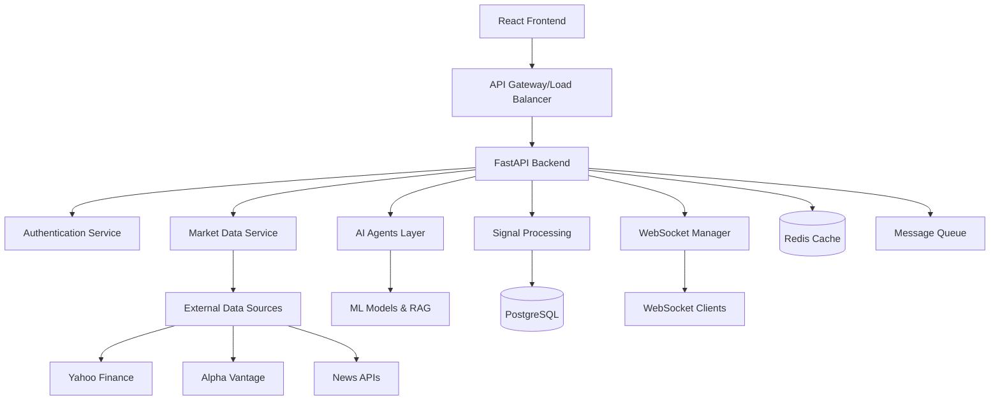

# System Architecture

GoldenSignalsAI is a microservices-based AI-powered trading system built with Python, FastAPI, and React.

## High-Level Architecture



## Core Components

### 1. Frontend Layer
- **Technology**: React 18 with TypeScript
- **State Management**: Zustand for global state
- **Charts**: D3.js + Lightweight Charts hybrid system
- **WebSocket**: Real-time data streaming
- **Location**: `/frontend/`

### 2. API Gateway Layer
- **Technology**: FastAPI with Pydantic validation
- **Authentication**: JWT with OAuth2 flows
- **Rate Limiting**: Per-user and per-endpoint limits
- **Documentation**: Auto-generated OpenAPI specs
- **Location**: `/backend/api/`

### 3. AI Agents Layer
- **Base Agent**: Abstract agent framework
- **Technical Analysis**: TA-Lib indicators and pattern recognition
- **Sentiment Analysis**: Multi-source sentiment aggregation
- **Volatility Analysis**: VIX and options-based volatility
- **Location**: `/backend/agents/`

### 4. Services Layer
- **Data Aggregation**: Multi-source market data
- **WebSocket Manager**: Real-time communication
- **RAG System**: Knowledge retrieval and generation
- **MCP Server**: Model Context Protocol implementation
- **Location**: `/backend/services/`

### 5. Data Layer
- **Primary Database**: PostgreSQL for transactional data
- **Cache Layer**: Redis for high-frequency data
- **Vector Store**: ChromaDB for embeddings
- **Time Series**: Optimized for OHLCV data
- **Location**: `/backend/models/`

## Architecture Patterns

### 1. Event-Driven Architecture
```python
# Event publishing
await event_bus.publish(
    event_type="signal_generated",
    data=signal,
    routing_key="signals.technical"
)

# Event consumption
@event_handler("signal_generated")
async def handle_signal(event):
    await websocket_manager.broadcast_signal(event.data)
```

### 2. Repository Pattern
```python
class SignalRepository:
    async def create(self, signal: Signal) -> Signal:
        # Database operations
        
    async def find_by_symbol(self, symbol: str) -> List[Signal]:
        # Query operations
```

### 3. Dependency Injection
```python
@inject
class TechnicalAgent:
    def __init__(
        self,
        market_service: MarketDataService,
        cache: CacheService
    ):
        self.market_service = market_service
        self.cache = cache
```

### 4. Circuit Breaker Pattern
```python
@circuit_breaker(failure_threshold=5, recovery_timeout=60)
async def get_market_data(symbol: str):
    # Protected external API call
```

## Data Flow

### Signal Generation Pipeline
1. **Market Data Ingestion**: Multiple sources → Data Aggregator
2. **Agent Analysis**: Individual agents process data
3. **Consensus Building**: Orchestrator combines agent outputs
4. **Signal Generation**: Final signal with confidence scoring
5. **Real-time Broadcasting**: WebSocket distribution
6. **Persistence**: Database storage with metadata

### WebSocket Communication
1. **Client Connection**: Authentication and room subscription
2. **Real-time Updates**: Price, signals, and agent updates
3. **Heartbeat Management**: Connection health monitoring
4. **Graceful Degradation**: Fallback mechanisms

## Scalability Considerations

### Horizontal Scaling
- **Stateless Services**: All services designed for horizontal scaling
- **Load Balancing**: Round-robin with health checks
- **Database Sharding**: By symbol or time range
- **Cache Distribution**: Redis Cluster for high availability

### Performance Optimization
- **Connection Pooling**: Database and external API connections
- **Async/Await**: Non-blocking I/O throughout
- **Caching Strategy**: Multi-level caching (L1: Memory, L2: Redis)
- **Batch Processing**: Bulk operations where possible

### Fault Tolerance
- **Graceful Degradation**: System continues with reduced functionality
- **Circuit Breakers**: Prevent cascade failures
- **Retry Logic**: Exponential backoff with jitter
- **Health Checks**: Comprehensive monitoring

## Security Architecture

### Authentication & Authorization
- **JWT Tokens**: Stateless authentication
- **Role-based Access**: User/Admin permissions
- **API Key Management**: External service authentication
- **Rate Limiting**: DDoS protection

### Data Protection
- **Encryption**: TLS 1.3 for data in transit
- **Secrets Management**: Environment-based configuration
- **Input Validation**: Pydantic schemas
- **SQL Injection Prevention**: ORM-based queries

## Development Workflow

### Code Organization
```
backend/
├── api/           # FastAPI routes and middleware
├── agents/        # AI agents and orchestration
├── core/          # Configuration, database, auth
├── models/        # Database models
├── services/      # Business logic services
├── tests/         # Comprehensive test suite
└── docs/          # Documentation
```

### Testing Strategy
- **Unit Tests**: Individual component testing
- **Integration Tests**: Service interaction testing
- **API Tests**: Endpoint validation
- **Performance Tests**: Load and stress testing

## Monitoring & Observability

### Metrics Collection
- **System Metrics**: CPU, memory, network
- **Application Metrics**: Request rates, response times
- **Business Metrics**: Signal accuracy, user engagement
- **Custom Metrics**: Agent performance, data quality

### Logging Strategy
- **Structured Logging**: JSON format with correlation IDs
- **Log Levels**: DEBUG, INFO, WARN, ERROR, FATAL
- **Log Aggregation**: Centralized logging system
- **Alert Management**: Automated issue detection

## Technology Stack Summary

| Component | Technology | Purpose |
|-----------|------------|---------|
| Frontend | React 18 + TypeScript | User interface |
| Backend | FastAPI + Python 3.12 | API server |
| Database | PostgreSQL 14+ | Primary data store |
| Cache | Redis 7+ | High-speed cache |
| Vector DB | ChromaDB | Embeddings storage |
| Message Queue | Redis Streams | Event processing |
| Authentication | JWT + OAuth2 | Security |
| Charts | D3.js + Lightweight Charts | Visualization |
| WebSocket | FastAPI WebSockets | Real-time comms |
| AI/ML | OpenAI + Anthropic APIs | Language models |
| Market Data | Multiple APIs | External data |

## Next Steps

1. **Microservices Split**: Consider splitting into smaller services
2. **Event Sourcing**: Implement for audit trails
3. **CQRS**: Separate read/write operations
4. **Kubernetes**: Container orchestration
5. **GraphQL**: Alternative API layer