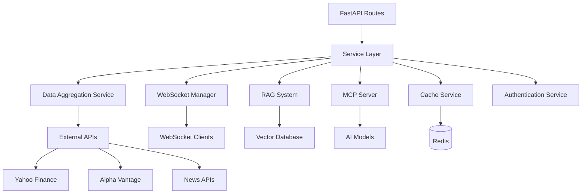

# Services Documentation

GoldenSignalsAI services layer provides core business logic and integrations for the trading system.

## Service Architecture



## Core Services

### 1. Enhanced Data Aggregator

**Purpose**: Aggregates market data from multiple sources with real-time capabilities.

**Key Features**:
- Multi-source data aggregation
- Real-time price feeds
- Technical indicators calculation  
- Data quality validation
- Caching for performance

**Usage Example**:
```python
from services.enhanced_data_aggregator import EnhancedDataAggregator

aggregator = EnhancedDataAggregator()

# Get basic market data
data = await aggregator.get_market_data(
    symbols=["AAPL", "TSLA"],
    timeframe="1d",
    include_indicators=True
)

# Get real-time data
real_time = await aggregator.get_real_time_data("AAPL")

# Get blockchain metrics
crypto_data = await aggregator.get_blockchain_metrics(["BTC", "ETH"])
```

**Configuration**:
```python
config = {
    "sources": {
        "yahoo_finance": {"enabled": True, "priority": 1},
        "alpha_vantage": {"enabled": True, "priority": 2},
        "finnhub": {"enabled": True, "priority": 3}
    },
    "cache_ttl": 60,  # seconds
    "rate_limits": {
        "yahoo_finance": 2000,  # requests per hour
        "alpha_vantage": 500,
        "finnhub": 300
    }
}
```

### 2. WebSocket Manager

**Purpose**: Manages real-time WebSocket connections and message broadcasting.

**Key Features**:
- Room-based subscriptions
- Message queuing
- Connection health monitoring
- Automatic reconnection
- Rate limiting

**Usage Example**:
```python
from services.websocket_manager import ws_manager, SignalUpdate

# Connect client
client_id = await ws_manager.connect(websocket, {"user_id": 123})

# Subscribe to updates
await ws_manager.subscribe(client_id, "AAPL")

# Broadcast signal update
signal = SignalUpdate(
    symbol="AAPL",
    signal_id="signal_123",
    action="BUY",
    confidence=0.85,
    price=150.0,
    agents_consensus={"technical": "BUY"},
    timestamp=datetime.now()
)
await ws_manager.broadcast_signal(signal)

# Get metrics
metrics = ws_manager.get_metrics()
```

**Message Types**:
- `signal_update` - Trading signal updates
- `price_update` - Real-time price changes
- `agent_update` - Individual agent analysis
- `decision_update` - Final trading decisions
- `alert` - System notifications
- `heartbeat` - Connection health

### 3. RAG System (Retrieval-Augmented Generation)

**Purpose**: Provides intelligent knowledge retrieval and generation for market insights.

**Key Features**:
- Vector-based document search
- Multi-LLM support (OpenAI, Anthropic)
- Real-time knowledge updates
- Context-aware responses
- Document ingestion pipeline

**Usage Example**:
```python
from services.rag_service import rag_service

# Query knowledge base
results = await rag_service.query(
    "What is the current market sentiment for AAPL?",
    use_llm=True,
    provider="openai"
)

# Ingest new documents
documents = [
    {
        "id": "doc_123",
        "content": "Apple reports strong Q4 earnings...",
        "source": "earnings_reports",
        "document_type": "financial_news"
    }
]
await rag_service.ingest_documents(documents)

# Update market context
await rag_service.update_market_context(
    symbol="AAPL",
    market_data={"price": 150.0, "volume": 1000000},
    analysis_results={"signal": "BUY", "confidence": 0.8}
)
```

**Supported LLM Providers**:
- OpenAI (GPT-3.5, GPT-4)
- Anthropic (Claude)
- Local models via API

### 4. MCP Server (Model Context Protocol)

**Purpose**: Standardized interface for AI model interactions and tool usage.

**Key Features**:
- Tool registration and execution
- Multi-model support
- Context management
- Error handling
- Performance monitoring

**Usage Example**:
```python
from services.mcp.mcp_server import MCPServer, MCPMessage

server = MCPServer()

# Handle MCP message
message = MCPMessage(
    id="msg_123",
    method="tools/execute",
    params={"tool": "get_market_data", "params": {"symbol": "AAPL"}},
    timestamp=datetime.now()
)

response = await server.handle_message(message)

# Register custom tool
from services.mcp.mcp_server import MCPTool

class CustomTool(MCPTool):
    @property
    def name(self):
        return "custom_analysis"
    
    async def execute(self, params):
        return {"result": "custom analysis result"}

server.register_tool(CustomTool())
```

**Available Tools**:
- `get_market_data` - Retrieve market data
- `generate_signal` - Generate trading signals
- `analyze_portfolio` - Portfolio analysis
- Custom tools via registration

### 5. Social Sentiment Analyzer

**Purpose**: Analyzes sentiment from social media and news sources.

**Key Features**:
- Multi-platform analysis (Twitter, Reddit, News)
- Real-time sentiment tracking
- Trending topics detection
- Sentiment scoring and aggregation

**Usage Example**:
```python
from services.social_sentiment_analyzer import SocialSentimentAnalyzer

analyzer = SocialSentimentAnalyzer()

# Analyze sentiment for symbol
sentiment = await analyzer.analyze_symbol_sentiment("AAPL")
{
    "overall_sentiment": 0.73,
    "confidence": 0.85,
    "sources": {
        "twitter": {"sentiment": 0.8, "volume": 1500},
        "reddit": {"sentiment": 0.65, "volume": 300},
        "news": {"sentiment": 0.75, "volume": 50}
    },
    "trending_topics": ["earnings", "innovation", "growth"]
}

# Get trending topics
trending = await analyzer.get_trending_topics()

# Analyze news sentiment
news_sentiment = await analyzer.analyze_news_sentiment("AAPL")
```

### 6. Live Data Provider

**Purpose**: Provides real-time market data with failover capabilities.

**Key Features**:
- Multi-source data feeds
- Automatic failover
- Data normalization
- Rate limit management
- Historical data access

**Usage Example**:
```python
from services.live_data_provider import LiveDataProvider

provider = LiveDataProvider()

# Get current price
price_data = await provider.get_current_price("AAPL")

# Get historical data
historical = await provider.get_historical_data(
    symbol="AAPL",
    period="1y",
    interval="1d"
)

# Stream real-time data
async for update in provider.stream_prices(["AAPL", "TSLA"]):
    print(f"Price update: {update}")
```

## Service Integration Patterns

### 1. Service Dependency Injection

```python
from core.container import Container

# Service registration
container = Container()
container.register(EnhancedDataAggregator, singleton=True)
container.register(WebSocketManager, singleton=True)

# Service resolution
data_service = container.resolve(EnhancedDataAggregator)
ws_service = container.resolve(WebSocketManager)
```

### 2. Event-Driven Communication

```python
from core.events import event_bus

# Publish events
await event_bus.publish(
    event_type="price_update",
    data={"symbol": "AAPL", "price": 150.0},
    routing_key="market.price"
)

# Subscribe to events
@event_bus.subscriber("price_update")
async def handle_price_update(event):
    await ws_manager.broadcast_price_update(
        event.data["symbol"],
        event.data["price"],
        event.data.get("volume", 0)
    )
```

### 3. Circuit Breaker Pattern

```python
from core.resilience import circuit_breaker

@circuit_breaker(failure_threshold=5, recovery_timeout=60)
async def get_external_data(symbol: str):
    # Protected external API call
    pass
```

## Configuration Management

### Environment Variables

```bash
# Data aggregation
DATA_AGGREGATOR_CACHE_TTL=300
DATA_AGGREGATOR_MAX_SOURCES=5
DATA_AGGREGATOR_TIMEOUT=30

# WebSocket
WEBSOCKET_MAX_CONNECTIONS=1000
WEBSOCKET_HEARTBEAT_INTERVAL=30
WEBSOCKET_MESSAGE_QUEUE_SIZE=10000

# RAG System
RAG_EMBEDDING_MODEL="sentence-transformers/all-MiniLM-L6-v2"
RAG_VECTOR_DB_URL="http://localhost:8000"
RAG_CACHE_TTL=3600

# External APIs
YAHOO_FINANCE_TIMEOUT=10
ALPHA_VANTAGE_API_KEY="your_key"
FINNHUB_API_KEY="your_key"
```

### Service Configuration

```python
from core.config import ServiceConfig

config = ServiceConfig(
    data_aggregator={
        "cache_ttl": 300,
        "max_concurrent_requests": 10,
        "enable_websocket": True
    },
    websocket_manager={
        "max_connections": 1000,
        "heartbeat_interval": 30,
        "message_rate_limit": 100
    }
)
```

## Monitoring and Observability

### Metrics Collection

```python
from core.monitoring import metrics

# Custom metrics
metrics.counter("service.requests.total").inc()
metrics.histogram("service.response_time").observe(0.5)
metrics.gauge("service.active_connections").set(150)

# Automatic service metrics
@metrics.track_performance
async def service_method():
    # Automatically tracked
    pass
```

### Health Checks

```python
from core.health import health_check

@health_check
async def data_aggregator_health():
    """Check data aggregator health"""
    try:
        await data_service.ping()
        return {"status": "healthy", "response_time": 0.1}
    except Exception as e:
        return {"status": "unhealthy", "error": str(e)}

# Health check endpoint: GET /health
```

### Distributed Tracing

```python
from core.tracing import tracer

@tracer.trace("service.analyze")
async def analyze_symbol(symbol: str):
    with tracer.span("data.fetch") as span:
        span.set_tag("symbol", symbol)
        data = await data_service.get_data(symbol)
    
    with tracer.span("analysis.process"):
        result = process_data(data)
    
    return result
```

## Error Handling and Resilience

### Service-Level Error Handling

```python
from core.exceptions import ServiceException, error_handler

class DataAggregatorException(ServiceException):
    """Data aggregation specific errors"""
    pass

@error_handler
async def get_market_data(symbol: str):
    try:
        return await external_api.get_data(symbol)
    except APIError as e:
        raise DataAggregatorException(
            f"Failed to get data for {symbol}",
            recoverable=True,
            context={"symbol": symbol, "error": str(e)}
        )
```

### Retry Logic

```python
from core.resilience import retry

@retry(
    max_attempts=3,
    backoff_factor=2,
    exceptions=(ConnectionError, TimeoutError)
)
async def fetch_external_data(url: str):
    # Resilient external API call
    pass
```

### Graceful Degradation

```python
async def get_market_data_with_fallback(symbol: str):
    """Get market data with fallback options"""
    try:
        # Primary source
        return await primary_source.get_data(symbol)
    except Exception:
        try:
            # Secondary source
            return await secondary_source.get_data(symbol)
        except Exception:
            # Cached data as fallback
            return await cache.get_cached_data(symbol)
```

## Testing Services

### Unit Testing

```python
import pytest
from unittest.mock import Mock, AsyncMock
from services.enhanced_data_aggregator import EnhancedDataAggregator

@pytest.mark.asyncio
async def test_data_aggregator():
    aggregator = EnhancedDataAggregator()
    
    # Mock external dependencies
    with patch.object(aggregator, '_fetch_yahoo_data') as mock_fetch:
        mock_fetch.return_value = {"price": 150.0}
        
        result = await aggregator.get_market_data(["AAPL"])
        
        assert result["AAPL"]["price"] == 150.0
        mock_fetch.assert_called_once()
```

### Integration Testing

```python
@pytest.mark.asyncio
@pytest.mark.integration
async def test_service_integration():
    """Test service integration with real dependencies"""
    aggregator = EnhancedDataAggregator()
    ws_manager = WebSocketManager()
    
    # Test data flow
    data = await aggregator.get_market_data(["AAPL"])
    await ws_manager.broadcast_price_update(
        "AAPL", 
        data["AAPL"]["price"],
        data["AAPL"]["volume"]
    )
```

### Load Testing

```python
import asyncio
import time

async def load_test_websocket():
    """Load test WebSocket manager"""
    tasks = []
    
    # Create many concurrent connections
    for i in range(100):
        task = asyncio.create_task(
            simulate_client_connection(f"client_{i}")
        )
        tasks.append(task)
    
    # Measure performance
    start_time = time.time()
    await asyncio.gather(*tasks)
    end_time = time.time()
    
    print(f"Load test completed in {end_time - start_time:.2f} seconds")
```

## Performance Optimization

### Caching Strategies

```python
from core.cache import cache, TTL

# Method-level caching
@cache(ttl=TTL.MINUTES_5)
async def expensive_calculation(symbol: str):
    # Cached for 5 minutes
    pass

# Multi-level caching
class DataService:
    def __init__(self):
        self.l1_cache = {}  # Memory cache
        self.l2_cache = RedisCache()  # Distributed cache
    
    async def get_data(self, key):
        # L1 cache check
        if key in self.l1_cache:
            return self.l1_cache[key]
        
        # L2 cache check
        data = await self.l2_cache.get(key)
        if data:
            self.l1_cache[key] = data
            return data
        
        # Fetch and cache
        data = await self.fetch_data(key)
        await self.l2_cache.set(key, data, ttl=300)
        self.l1_cache[key] = data
        return data
```

### Connection Pooling

```python
from core.database import connection_pool

class DatabaseService:
    def __init__(self):
        self.pool = connection_pool(
            min_connections=5,
            max_connections=20,
            timeout=30
        )
    
    async def execute_query(self, query):
        async with self.pool.acquire() as conn:
            return await conn.execute(query)
```

### Async Optimization

```python
import asyncio

async def parallel_data_fetch(symbols):
    """Fetch data for multiple symbols in parallel"""
    tasks = [fetch_symbol_data(symbol) for symbol in symbols]
    return await asyncio.gather(*tasks, return_exceptions=True)

async def batched_processing(items, batch_size=10):
    """Process items in batches to avoid overwhelming resources"""
    results = []
    for i in range(0, len(items), batch_size):
        batch = items[i:i + batch_size]
        batch_results = await process_batch(batch)
        results.extend(batch_results)
    return results
```

## Security Considerations

### Input Validation

```python
from pydantic import BaseModel, validator

class MarketDataRequest(BaseModel):
    symbol: str
    timeframe: str
    
    @validator('symbol')
    def validate_symbol(cls, v):
        if not re.match(r'^[A-Z]{1,5}$', v):
            raise ValueError('Invalid symbol format')
        return v
    
    @validator('timeframe')
    def validate_timeframe(cls, v):
        if v not in ['1m', '5m', '15m', '1h', '1d']:
            raise ValueError('Invalid timeframe')
        return v
```

### API Key Management

```python
from core.security import SecretManager

class ExternalAPIService:
    def __init__(self):
        self.secret_manager = SecretManager()
    
    async def make_api_call(self, url):
        api_key = await self.secret_manager.get_secret("EXTERNAL_API_KEY")
        headers = {"Authorization": f"Bearer {api_key}"}
        # Make API call with secure headers
```

### Rate Limiting

```python
from core.rate_limiting import RateLimiter

rate_limiter = RateLimiter(
    requests_per_minute=100,
    burst_size=20
)

@rate_limiter.limit()
async def api_endpoint():
    # Rate-limited endpoint
    pass
```

## Deployment Considerations

### Docker Configuration

```dockerfile
# Service-specific Dockerfile
FROM python:3.12-slim

WORKDIR /app
COPY requirements.txt .
RUN pip install -r requirements.txt

COPY services/ ./services/
COPY core/ ./core/

EXPOSE 8000
CMD ["python", "-m", "services.data_aggregator"]
```

### Kubernetes Deployment

```yaml
# Service deployment
apiVersion: apps/v1
kind: Deployment
metadata:
  name: data-aggregator-service
spec:
  replicas: 3
  selector:
    matchLabels:
      app: data-aggregator
  template:
    spec:
      containers:
      - name: data-aggregator
        image: goldensignals/data-aggregator:latest
        ports:
        - containerPort: 8000
        env:
        - name: REDIS_URL
          value: "redis://redis-service:6379"
```

## Best Practices

1. **Service Isolation**: Each service has clear boundaries and responsibilities
2. **Async-First**: Use async/await for all I/O operations
3. **Error Handling**: Comprehensive error handling with recovery strategies
4. **Monitoring**: Extensive metrics and logging for observability
5. **Testing**: Unit, integration, and load testing for reliability
6. **Caching**: Multi-level caching for performance
7. **Security**: Input validation and secure API key management
8. **Scalability**: Design for horizontal scaling from the start